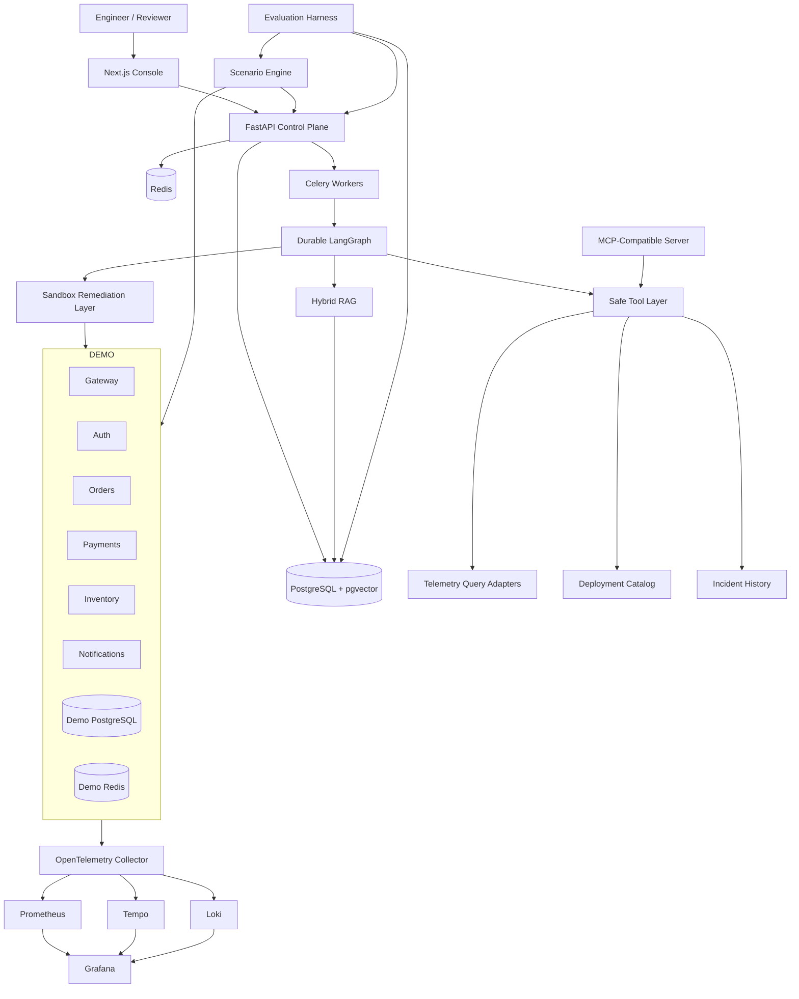
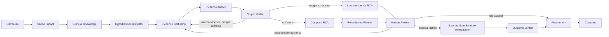

# IncidentGraph — Complete Architecture & Design

# A. System map

# B. Agent graph

# C. Why multiple roles instead of one agent

Each role is a bounded responsibility with a typed contract:
- less prompt entanglement
- easier evaluation
- clearer observability
- explicit contradiction step
- safer tool permissions
- interview-defensible architecture

Do not create autonomous agents that converse indefinitely.

# D. UI visual system

Direction:
- dark-first developer console
- neutral surfaces
- strong typography
- semantic severity colors only
- dense but readable tables
- monospace for IDs/traces/tool calls
- no cyberpunk gradients
- no fake AI animation

Core pages:
1. Dashboard
2. Incident
3. Investigation
4. RCA
5. Remediation approval
6. Outcome verification
7. Postmortem
8. Topology
9. Knowledge + RAG debugger
10. Scenarios
11. Evaluations
12. Evaluation compare
13. Audit
14. Settings

# E. Dashboard

Top metrics:
- open incidents
- investigation success rate
- current benchmark RCA accuracy
- unsupported-claim rate
- p95 investigation latency
- avg model cost

Main:
- topology
- recent incidents
- latest benchmark delta

Every metric must have provenance.

# F. Investigation experience

Timeline row types:
- SYSTEM
- RETRIEVAL
- HYPOTHESIS
- TOOL
- EVIDENCE
- VERIFIER
- RCA
- HUMAN_REVIEW
- REMEDIATION
- OUTCOME

Each row:
- timestamp
- actor/node
- purpose
- duration
- result
- evidence IDs
- expandable redacted payload

# G. RCA experience

Sections:
- root cause
- confidence score
- causal chain
- impact
- evidence
- rejected hypotheses
- unknowns
- remediation recommendation
- reviewer decision

No chat-bubble RCA.

# H. Remediation approval

Show:
- proposed action type
- target
- parameters
- expected effect
- risk
- rollback plan
- exact allow-listed implementation that will execute

Human presses Approve.

After execution:
- capture telemetry window
- compare before/after
- mark effective / ineffective / inconclusive

# I. Evaluation UX

Cards:
- RCA accuracy
- service accuracy
- causal correctness
- evidence recall
- evidence precision
- unsupported claims
- tool correctness
- retrieval Recall@5
- p95
- cost

Scenario matrix:
- ground truth
- prediction
- result
- key misses
- tool score
- evidence score
- latency
- cost

Compare view:
baseline vs candidate with regression thresholds.

# J. RAG debugger

Show side-by-side:
- vector ranking
- lexical ranking
- RRF ranking
- selected context
- relevance labels
- document metadata

# K. Trace/log/metrics experience

Trace waterfall:
- spans by service
- duration
- errors
- attributes
- link to correlated logs

Logs:
- filter service/severity/time
- trace_id link
- bounded pagination

Metrics:
- request latency
- error rate
- dependency latency
- DB pool
- queues/retries
- scenario marker overlays

# L. Public guided demo

1. choose incident
2. read one-line fault explanation
3. trigger
4. see live system degrade
5. open created incident
6. start AI investigation
7. observe real tool/evidence timeline
8. review RCA
9. approve safe remediation
10. verify recovery
11. open benchmark result

No shortcut bypassing real backend.

